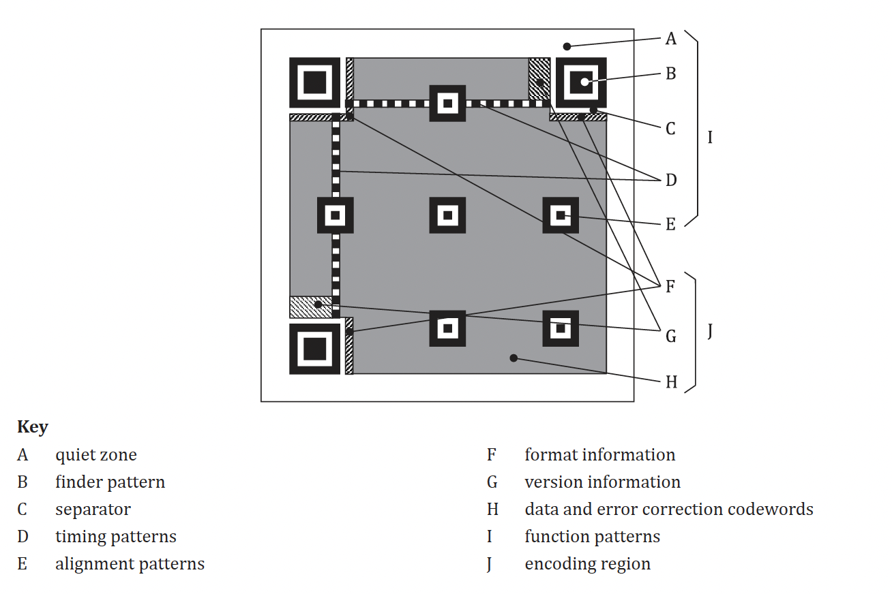
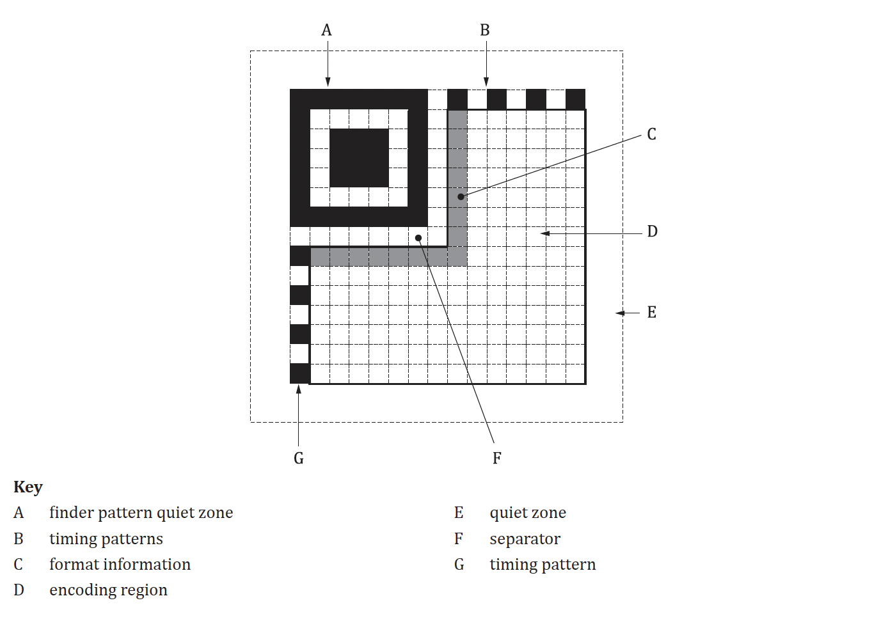

# 02 — structure

Defining the composition of a QR Code, specifying the purpose of each region. More detailed specification on each feature will be located in Requirements.

## QR Code Structure

**Alignment Patterns** - reference squares present in QR Codes of version 2 or larger that allow scanners to correct distortion

**Version Information**

**Data and Error Correction Codewords**

**Function Patterns**

## Micro QR Code Structure

## Mutual features of QR Code and Micro QR Code Structure

**Quiet zone** - an unmarked area surrounding the symbol in all 4 sides. It must match the colour of the light modules. 
 - For QR codes, the minimum width is 4 x module size
 - For Micro QR codes, the minimum width 2 x module size

**Finder Pattern** - Patterns located in corner(s) to identify location and orientation of the symbol
 - For QR codes, they are located in the upper left, upper right and lower left corners
 - For Micro QR codes, it is located in the upper left corner

**Separator** - one-module wide separation, consisting of light modules, between finder pattern and encoding region

**Encoding Region** - contains the data and error correction codewords, function information and where appropriate, version information

**Timing Patterns** - one-module wide row or column of dark and light modules, which provides information on symbol density and version and acts as a reference for determining module positions

**Format Information**