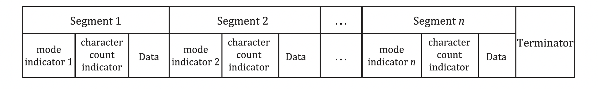

# 03 — Encoding

blah blah

1. **Data Analysis**
2. **Data Encoding**
3. Error Correction Coding
4. Structure Final Message
5. Module Placement in Matrix
6. Data Masking
7. Format and Version Information

## Modes

blah blah

## Extended Channel Interpretation (ECI)
- allows encoding of characters other than the default character set (mentioned below)
- ECI escape sequence is added to the data, followed by a mode indicator
- ECI is **not** supported in Micro QR Codes

## Numeric Mode
- encodes data from the decimal digit set (0 - 9)
- 3 digits are represented by 10 bits ($2^{10} = 1024 > 1000$, ie number of 3-digit numbers)
- 2 digits are represented by 7 bits ($2^{7} = 128 > 100$, ie number of 2-digit number)
- 1 digit is represented by 4 bits ($2^{4} = 16 > 10$, ie number of 1-digit number)

> ### Converting 01234567 using numeric mode : 
> 
> 1. input data is split into groups of 3
> $$012\;345\;67$$
> 2. each group is converted to its binary equivalent 
> $$ 012 \rightarrow 0000001100 $$
> $$ 345 \rightarrow 0101011001 $$
> $$ 67 \rightarrow 1000011 $$
> 3. the binary data is joined together
> $$0000001100\;0101011001\;1000011$$
> 4. the character count is converted into binary
> $$8 \rightarrow 0000001000 $$
> 5. mode indicator and char count is joined to the input data
> $$0001\;0000001000\;0000001100\;0101011001\;1000011$$
> 
> **NOTE**
> - mode indicator is 4-bits for QR Code and 2-bits for Micro QR Code
> - character count indicator's bits depend on version (1-H in the example)

**Formula for length of output bit stream:**

$$B = M +C +10(D\;div\;3) + R$$

where

- $B$ is the no. of bits in bit stream

- $M$ is the no. of bits in mode indicator (as seen in mode indicator table blah blah)

- $C$ is the no. of bits in character count indicator (blah blah)

- $D$ is the no. of input data characters

- $R$ is:
  - $0$ if $D\;mod\;3 = 0$
  - $4$ if $D\;mod\;3 = 1$
  - $7$ if $D\;mod\;3 = 2$

## Alphanumeric Mode
- encodes data from a set of 45 characters, consisting of:
    - 10 numeric digits (0 - 9)
    - 26 alphabetic characters (A - Z)
    - 9 symbols (SPACE, $, %, *, +, -, ., /, :)
- 2 characters are represented by 11 bits ($2^{11} = 2048 > 45*45=2045$)
- 1 character is represented by 6 bits ($2^{6} = 64 > 45$) 
- not available in M1 and M2 Micro QR Code

$$character\:value = 45 × C_1​ + C_2​$$
where 
- $C_1$ = first character
- $C_2$ = second character

> ### Converting AC-42 using alphanumeric mode : 
> 
> 1. input data is converted to character value, according to [alphanumeric.md](./tables/alphanumeric.md)
> $$AC-42 \rightarrow (10,12,41,4,2)$$
> 2. character values is split into groups of 2
> $$ (10,12) (41,4) (2) $$
> 3. each group is converted to its binary equivalent 
> $$ (10,12) \rightarrow 10*45+12 \rightarrow 462 \rightarrow 00111001110 $$
> $$ (41,4) \rightarrow 41*45+4 \rightarrow 1849 \rightarrow 11100111001 $$
> $$ (2) \rightarrow 2 \rightarrow 000010 $$
> 3. the binary data is joined together
> $$00111001110\;11100111001\;000010$$
> 4. the character count is converted into binary
> $$5 \rightarrow 000000101 $$
> 5. mode indicator and char count is joined to the input data
> $$0010\;000000101\;00111001110\;11100111001\;000010$$
> 
> **NOTE**
> - mode indicator is 4-bits for QR Code and 2-bits for Micro QR Code
> - character count indicator's bits depend on version (1-H in the example)

**Formula for length of output bit stream:**

$$B = M +C +11(D\;div\;2) + 6(D\;mod\;2)$$

where

- $B$ is the no. of bits in bit stream

- $M$ is the no. of bits in mode indicator (as seen in mode indicator table blah blah)

- $C$ is the no. of bits in character count indicator (blah blah)

- $D$ is the no. of input data characters

## Byte
- encodes 8 bits per character
- not available in M1 and M2 Micro QR Code

> ### Converting Hello using byte mode : 
> 
> 1. each character is converted to its binary equivalent, according to [alphanumeric.md](./tables/byte.md)
> $$ H \rightarrow 01001000 $$
> $$ e \rightarrow 01100101 $$
> $$ l \rightarrow 01101100 $$
> $$ l \rightarrow 01101100 $$
> $$ o \rightarrow 01101111 $$
> 2. the binary data is joined together
> $$01001000\;01100101\;01101100\;01101100\;01101111$$
> 3. the character count is converted into binary
> $$5 \rightarrow 00000101 $$
> 4. mode indicator and char count is joined to the input data
> $$0100\;00000101\;01001000\;01100101\;01101100\;01101100\;01101111$$
> 
> **NOTE**
> - mode indicator is 4-bits for QR Code and 2-bits for Micro QR Code
> - character count indicator's bits depend on version (1-H in the example)

**Formula for length of output bit stream:**

$$B =M + C + 8D$$

where

- $B$ is the no. of bits in bit stream

- $M$ is the no. of bits in mode indicator (as seen in mode indicator table blah blah)

- $C$ is the no. of bits in character count indicator (blah blah)

- $D$ is the no. of input data characters

## Kanji
- 
- not available in M1 and M2 Micro QR Code

<!-- TODO -->

## Mixing Modes

blah blah

## FNC1 

blah blah blah

## Terminator

- sequence of 0 bits at the end of the bit stream, to signal the end of data
- can be omitted if the data fills up the capacity of the symbol
- can be reduced if the remaining capacity is less than the required bit length